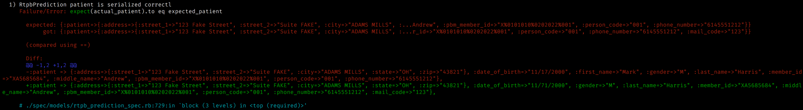
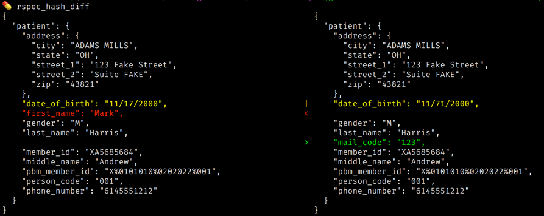
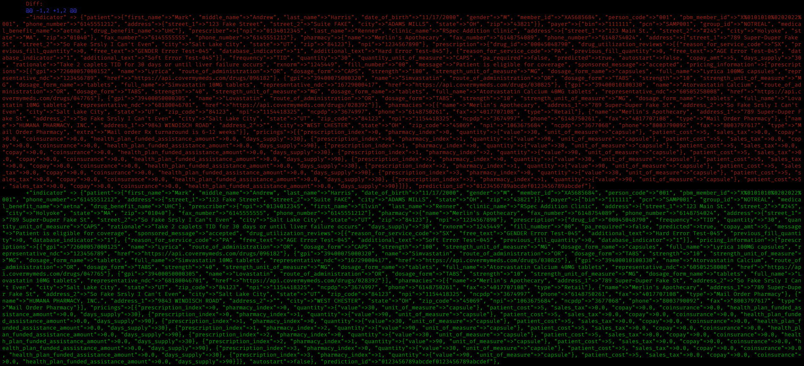
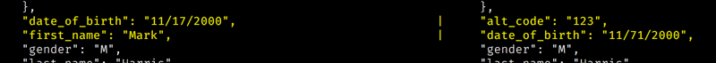

# rspec_hash_diff

Tool/kludge/hack to make inscrutable hash diffs much more... well, _scrutable_.

TL;DR When RSpec gives you this:

I give you _this_, because _I love you more_.

## The Problem

When you're debugging an API, sometimes the difference between what you expect
and what you get is very small, but buried inside a very large server
response. RSpec tries to helpfully give you the diff of the two hashes, but good
luck finding the changes in a response like this:

## A Solution

This is still in "kludgy hack" stage, but right now the rspec_hash_diff and
hash_diff.rb files here in bin work together with the ruby json gem and the
colordiff program (available at [www.colordiff.org](https://www.colordiff.org/),
you can get it with `brew install colordiff` or `sudo apt-get install
colordiff`; it's linux open source so you can download and install it manually
if you need to).

Here's a less ambitious example. Say we are testing a patient serializer
class. I have deliberately broken the specs so that the first name is omitted,
the date of birth has a transposition, and the serializer then adds a
"mail_code" field to the the patient object. As you can see, even on a much
smaller hash the rspec diff isn't super helpful:

But if we copy the two lines from the diff and run them through
`rspec_hash_diff`, we get a different story:

## It's Not Perfect

* I use JSON.pretty_generate to render the hashes in a pretty, line-oriented way
  that colordiff can render. Since JSON doesn't support symbol keys, this means
  you're only ever going to see string keys in the diffs.
* In order to make the diffs line up even when one hash is out of order compared
  to another, I sort the keys of both hashes. This sort is done recursively on
  all included subhashes and arrays. Arrays are NOT sorted, but they do get
  searched recursively for hashes, and those DO get sorted.
* At the end of the day it's a line-by-line comparison of the JSON. This means
  if one hash omits a key and the other hash adds a key, and they happen to be
  on the same line, they'll appear as a change rather than separate
  addition/omission entries. A few other things can trigger apparent changes
  like adding or omitting a value at the end of a hash, which appears as a
  two-line change because the previous line will now have a comma at the end of
  it. TL;DR you may see "change" when you actually have additions or omissions.

IMO, it's not perfect, but it's still an improvement. But then I'm biased
because I wrote it.
